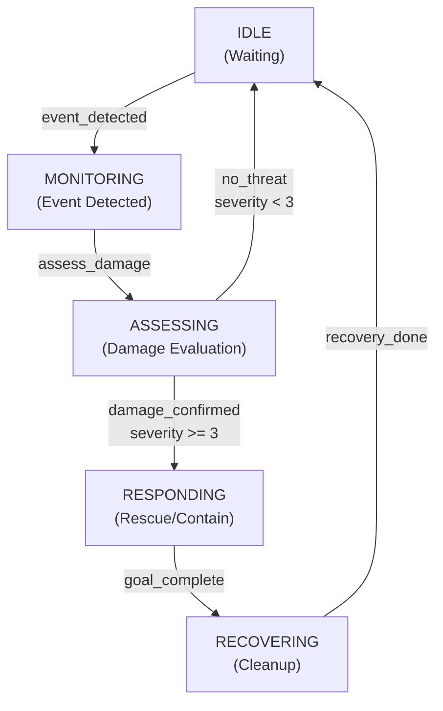

# Lab 3 — FSM Diagram

## Disaster Response Agent FSM

The following diagram shows the state machine for a reactive rescue/response agent:

## State Descriptions

| State | Description | Trigger | Next State |
|-------|-------------|---------|-----------|
| **IDLE** | Agent waiting for events | event_detected | MONITORING |
| **MONITORING** | Sensor detects anomaly | assess_damage | ASSESSING |
| **ASSESSING** | Evaluating damage severity | damage_confirmed (sev≥3) | RESPONDING |
| **ASSESSING** | (alternate) | no_threat (sev<3) | IDLE |
| **RESPONDING** | Executing rescue/containment | goal_complete | RECOVERING |
| **RECOVERING** | Post-incident cleanups | recovery_done | IDLE |

## Event-Goal Mapping

- **event_detected** → Create ASSESS_DAMAGE goal
- **damage_confirmed** → Create RESCUE/EVACUATE goal  
- **goal_complete** → Mark goal as completed, transition to recovery

## Implementation

See `lab3_reactive_agent.py` for the complete ReactiveAgent implementation that uses this FSM.
